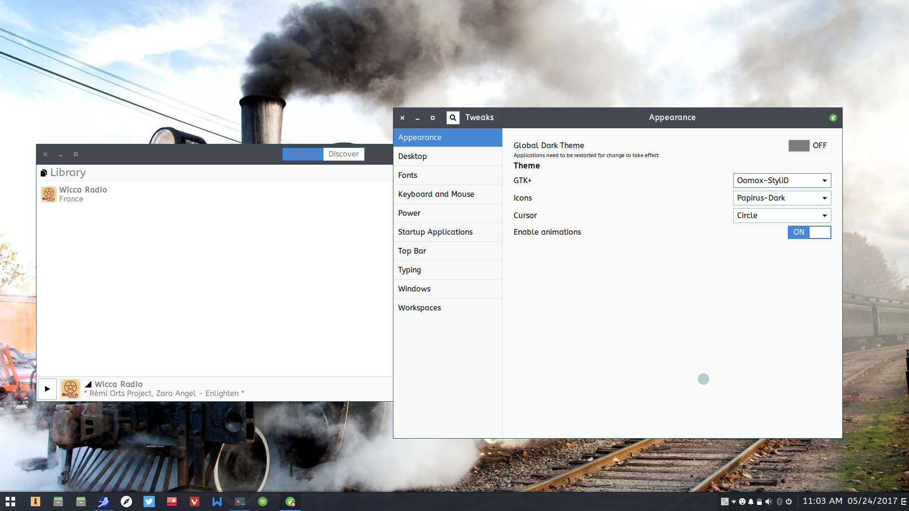

# StyliD
A Stylish Dark-inspired theme

I really dig the look of Stylish Dark (http://vinceliuice.deviantart.com/art/StylishDark-499195225) but sadly, it hasn't been updated for quite some time. So I've decided to breath in new life, but I'm not really skilled with CSS so I've used oomox to create this theme: https://github.com/actionless/oomox Therefore, it doesnt match the original 100% but it looks close enough IMHO.

This theme is compatible with GTK 2.x/3.20/3.22/3.24/3.25.x
Not sure if it's compatible with any GTK3 version lower than 3.20

This is the first version, I might tweak it a little bit. Let me know what you think and if it's compatible with versions lower than 3.20

I hope you like it! :-)

**SCREENSHOT**

**INSTALLATION**
- Download the theme from the releases page and unzip or clone the repository
- If it doesn't exist yet, create a folder in your Home folder called *.themes* (really add the dot!)
- Use Ctrl + H (Nautilus and other GTK-based file managers) to show hidden folders/files
- Move the downloaded folder *StyliD* to the .themes folder

(alternatively, the theme can be installed system-wide by moving the *StyliD* folder to /usr/share/themes but you need root or sudo in order to so)
